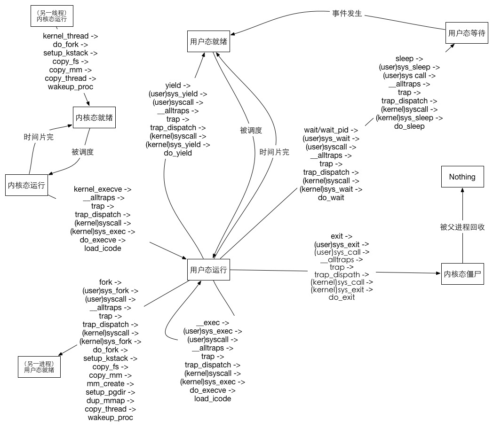

1.

```
trapframe的代码段寄存器应该设置成用户代码段选择子，数据段寄存器设置成用户数据段选择子，栈顶指针寄存器设置成初始用户栈顶，指令指针寄存器设置成程序的入口地址，在eflags中使能中断。


已经被修改过的进程在进行一场返回时，会把通用寄存器、段寄存器、栈指针恢复，此时这些寄存器已经是被被load_icode函数修改过的，执行iret指令后，就返回到trapframe中tf_eip指向的位置，下一条指令执行的就是新程序的第一条指令。

```
2

```
首先获得源页page的内核虚拟地址，再获得新分配的页npage的内核虚拟地址，之后复制这一页，之后把新页插入到木得mm_struct中去。


如果启用COW，则应该直接复制页表，同时在每个页表项中做一个标记，标记引用次数，当发生向该页的写操作时，如果引用次数大于1再分配一个页，重复copy_range中的过程。
```


3

```
在ulib.c中fork()函数调用sys_fork()，sys_fork()函数又调用用户态的syscall()函数进行系统调用，CPU进入异常处理，通过中断向量等一系列过程进入内核态的系统调用处理例程syscall()，又调用内核态sys_fork()，进而调用do_fork()，进行进程复制。

sys_exec()执行do_execve()函数来加载用户态程序，在此进程异常处理返回时就进入用户态执行。

wait()函数调用用户态sys_wait()，进而调用用户态syscall()进行系统调用，之后与上面过程类似进入到内核态的sys_wait()，然后进入do_wait()，在这个函数中父进程将进入睡眠状态等待僵尸态的子进程，释放子进程的内核态地址空间。

exit()函数调用用户态sys_exit()，进而调用用户态syscall()进行系统调用，之后与上面过程类似进入到内核态的sys_exit()，然后进入do_exit()函数，在这个函数中通过加载boot_cr3进入内核进程的地址空间，清理原进程的用户态地址空间，状态转变为僵尸态，如果有父进程等待该进程结束则唤醒父进程，之后进行进程调度。

进程状态转换图比较复杂，附图表示。除图中所示转换关系外，还应有一个进程调用kill杀死另一个进程的情况，这一过程图示比较复杂，略去不表。
```



